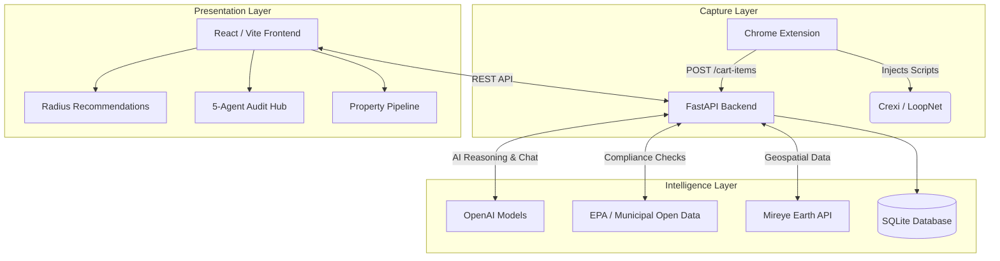
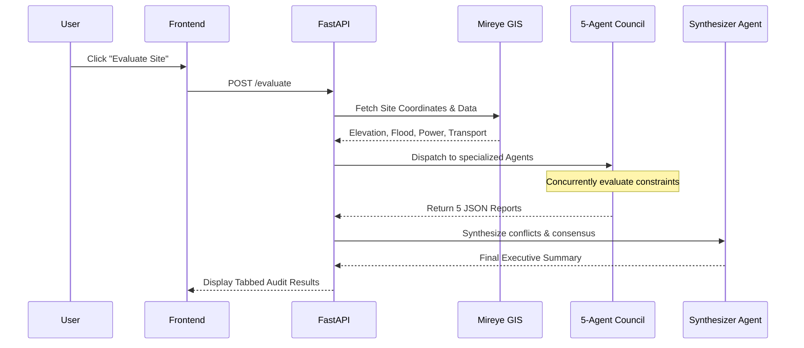

# 🌐 Site Ranker: Obsidian Intelligence System

> **Advanced AI-driven commercial real estate (CRE) site selection, multi-agent evaluation, and automated regulatory due diligence.**

The **Site Ranker** is an end-to-end intelligence platform designed to automate the arduous process of industrial and commercial site selection. It bridges the gap between raw web listings (Crexi, LoopNet) and deep geospatial/regulatory analysis by combining an intelligent browser extension, a Python-based Multi-Agent architecture, and a modern React frontend.

---

## 🏗️ System Architecture

The platform operates across three distinct layers: the **Capture Layer** (Chrome Extension), the **Intelligence Layer** (FastAPI & Agents), and the **Presentation Layer** (React Frontend).



---

## 🧠 Core Capabilities

### 1. 🕵️ Intelligent Web Capture (Chrome Extension)
- **Seamless Ingestion:** Instantly capture properties directly from Crexi or LoopNet listings.
- **Auto-Extraction:** Bypasses SPA (Single Page Application) routing to extract true listing IDs, prices, building sizes, and coordinates.
- **LLM Address Normalization:** Automatically batches and converts messy, slugified URLs into pristine physical addresses for hyper-accurate geocoding.

### 2. 🏛️ The 5-Agent Evaluation Council
Rather than relying on a single AI prompt, the system deploys a concurrent council of specialized agents to scrutinize a site's viability using **Mireye GIS Data**:
1. **⚡ Energy Agent:** Evaluates grid proximity and power capacity.
2. **💧 Water Agent:** Analyzes water source distance and drainage capacity.
3. **🏔️ Surface Agent:** Assesses elevation, slope, and topographic constraints.
4. **🚛 Transport Agent:** Audits distance to highways, rail networks, and ports.
5. **⚠️ Risk Agent:** Flags fatal flaws (flood zones, extreme weather, geological risks).
- **The Synthesizer:** A master agent reviews the 5 independent reports, resolves tensions (e.g., "Great power access, but high flood risk"), and generates a board-ready Executive Summary.

### 3. ⚖️ Automated Compliance & Regulatory Engine
- Interrogates municipal Open Data portals for building permits, certificates of occupancy, fire codes, and zoning violations.
- **AI Regulatory Fallback:** If a municipality lacks open data, the system automatically falls back to an LLM-driven Regulatory Agent to synthesize a highly accurate zoning and compliance baseline for that specific jurisdiction.

### 4. 🎯 Rule-Based Radius Recommendations
- Scans a 2km geodesic radius around your target site to find comparables.
- Ranks recommendations on a strict mathematical scale: **Proximity** (50 points) + **Asset Type Match** (30 points) + **Price Similarity** (20 points).
- Strict pipeline isolation ensures recommendations never clutter your primary property pipeline.

---

## ⚙️ Evaluation Workflow



---

## 🚀 Installation & Build Guide

### Prerequisites
- **Node.js** (v18+)
- **Python** (3.10+)
- **Google Chrome**

### 1. Backend Setup (FastAPI)
The backend handles the multi-agent logic, SQLite database (`site_ranker.db`), and GIS routing.

```bash
cd backend
python -m venv venv

# Activate the virtual environment
# Windows:
venv\Scripts\activate
# Mac/Linux:
source venv/bin/activate

pip install -r requirements.txt
```

**Environment Setup:**
Create a `.env` file inside the `backend/` directory:
```env
OPENAI_API_KEY=your_openai_api_key_here
MIREYE_BASE_URL=https://api.mireye.com
```

**Run the Backend Engine:**
```bash
python -m uvicorn main:app --reload --port 8000
```
*(The API will be available at `http://localhost:8000`)*

### 2. Frontend Setup (React)
The frontend drives the Obsidian UI, rendering the property matrix, compliance reports, and agent chat.

```bash
cd frontend
npm install
npm run dev
```
*(The dashboard will be available at `http://localhost:5173`)*

### 3. Chrome Extension Setup
The extension is required to populate your Property Pipeline.

1. Open Chrome and navigate to `chrome://extensions/`.
2. Toggle **"Developer mode"** ON (top right corner).
3. Click **"Load unpacked"**.
4. Select the `extension/` folder from this repository.
5. *Note: If you ever modify the extension files, remember to click the circular "Refresh" icon on the extension card.*

---

## 🗺️ How to Use the System

1. **Capture:** Browse Crexi or LoopNet. Open a property listing and click the Mireye extension icon to add it to your cart.
2. **Pipeline:** Open the Frontend (`http://localhost:5173`). Your captured properties will appear in the **Property Pipeline**.
3. **Audit:** Click into a property and press **Evaluate Site**. The 5-Agent Council will run a deep geospatial analysis.
4. **Chat & Refine:** Open the Site Intelligence Chat. Tell the system your exact requirements (e.g., *"I need this site for a data center"*). The requirements will be automatically saved to memory and factored into future audits.
5. **Expand:** Check the **Recommendations** tab to view rule-based comparables within a 2km radius. 

---
*Developed by the Mireye Earth Team.*
